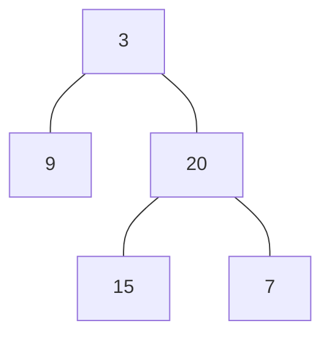
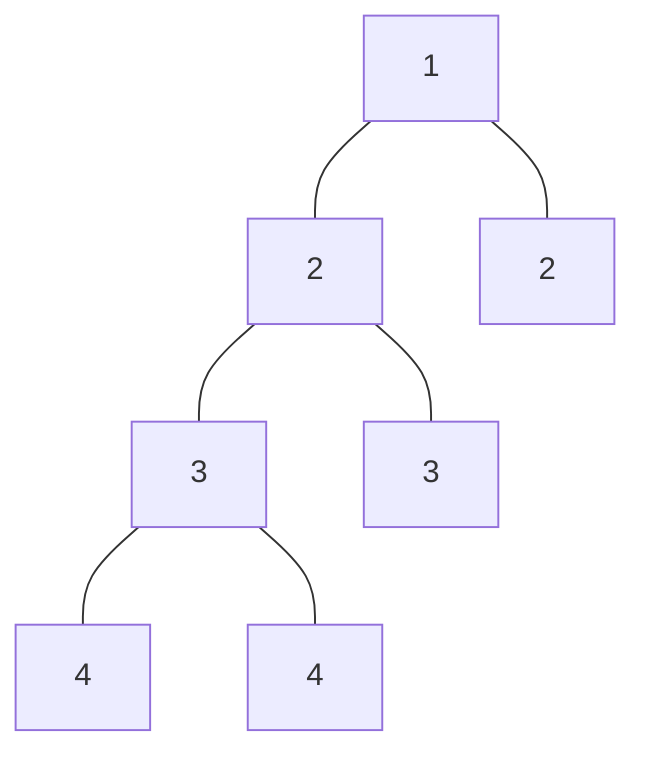

# Balanced Binary Tree

## 🚀 Problem  
Given a binary tree, determine if it is height-balanced.

## 📝 Examples  

### Example 1


```
Input: root = [3,9,20,null,null,15,7]
Output: true
```

### Example 2


```
Input: root = [1,2,2,3,3,null,null,4,4]
Output: false
```

### Example 3
Input: root = []
Output: true

## ⚡ Constraints  
- The number of nodes in the tree is in the range `[0, 5000]`.
- `-10^4 <= Node.val <= 10^4`

## 📚 Related Topics  
- Binary tree

## 🔗 References  
- https://leetcode.com/problems/balanced-binary-tree/
