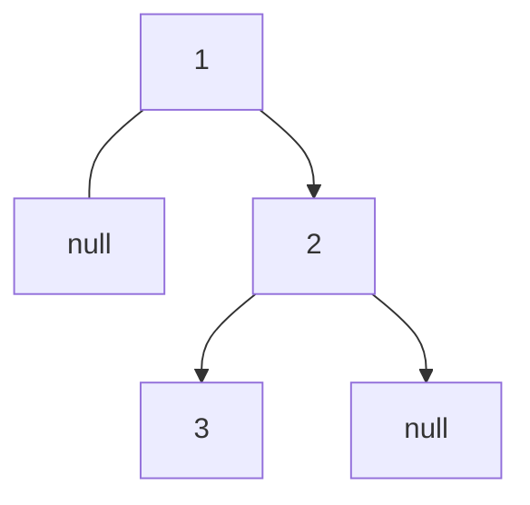
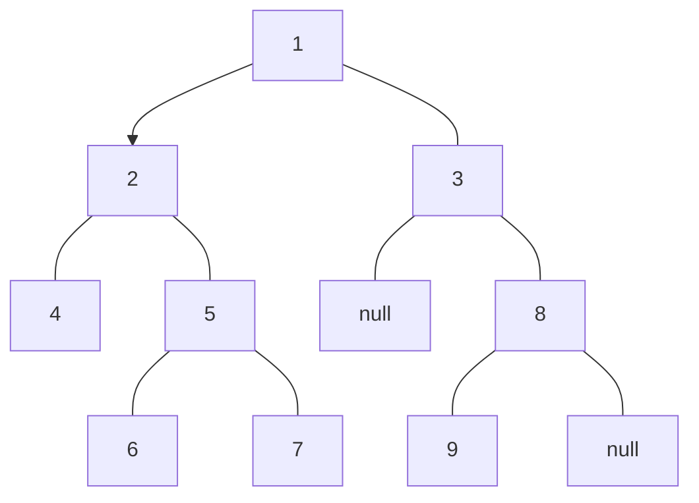

# Binary Tree Inorder Traversal

## 🚀 Problem  
Given the `root` of a binary tree, return the inorder traversal of its nodes' values.

## 📝 Examples  

### Example 1
```
Input: root = [1,null,2,3]
Output: [1,3,2]
```



### Example 2
```
Input: root = [1,2,3,4,5,null,8,null,null,6,7,9]
Output: [4,2,6,5,7,1,3,9,8]
```




## ⚡ Constraints  
- The number of nodes in the tree is in the range `[0, 100]`
- `-100 <= Node.val <= 100`

## 📚 Related Topics  
- Binary tree

## 🔗 References  
- https://leetcode.com/problems/binary-tree-inorder-traversal/
