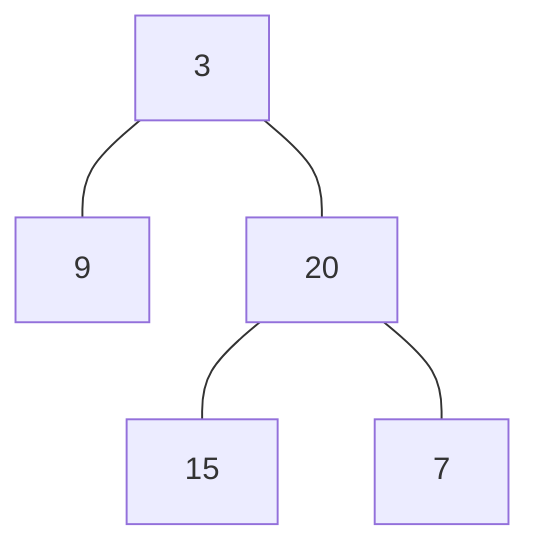
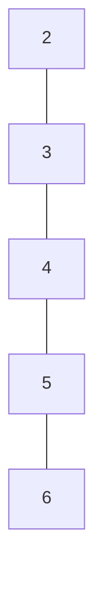

# Minimum Depth of Binary Tree

## 🚀 Problem  
Given a binary tree, find its minimum depth.
The minimum depth is the number of nodes along the shortest path from the root node down to the nearest leaf node.

**Note**: A leaf is a node with no children.

## 📝 Examples  

### Example 1


```
Input: root = [3,9,20,null,null,15,7]
Output: 2
```

### Example 2


```
Input: root = [2,null,3,null,4,null,5,null,6]
Output: 5
```

## ⚡ Constraints  
- The number of nodes in the tree is in the range `[0, 10^5]`
- `-1000 <= Node.val <= 1000`

## 📚 Related Topics  
- Binary tree
- DFS

## 🔗 References  
- https://leetcode.com/problems/minimum-depth-of-binary-tree/
