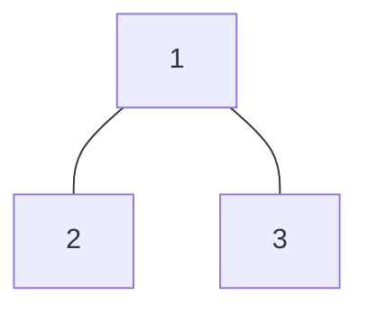

# Sum Root to Leaf Numbers

## 🚀 Problem  
You are given the `root` of a binary tree containing digits from `0` to `9` only.
Each root-to-leaf path in the tree represents a number.
- For example, the root-to-leaf path `1 ->2 -> 3` represents the number `123`.

Return the total sum of all root-to-leaf numbers. Test cases are generated so that the answer will fit in a 32-bit integer.
A leaf node is a node with no children.

## 📝 Examples  

### Example 1


```
Input: root = [1,2,3]
Output: 25
Explanation:
The root-to-leaf path `1->2` represents the number `12`.
The root-to-leaf path `1->3` represents the number `13`.
Therefore, sum = 12 + 13 = 25.
```

## ⚡ Constraints  
- The number of nodes in the tree is in the range `[0, 10^4]`
- `0 <= Node.val <= 9`
- The depth of the tree will not exceed `10`.

## 📚 Related Topics  
- Binary tree
- DFS
- Backtracking

## 🔗 References  
- https://leetcode.com/problems/sum-root-to-leaf-numbers/
